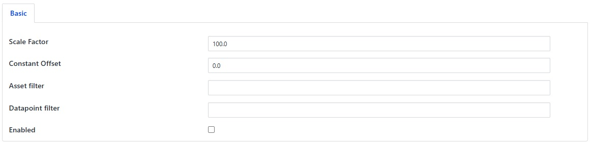

.. Images

Scale Filter
============

The *fledge-filter-scale* plugin is a simple filter that allows a scale factor and an offset to be applied to numerical data. It's primary uses are for adjusting values to match different measurement scales, for example converting temperatures from Centigrade to Fahrenheit or when a sensor reports a value in non-base units, e.g. 1/10th of a degree.

When adding a scale filter to either the south service or north task, via the *Add Application* option of the user interface, a configuration page for the filter will be shown as below;

+---------+
| |scale| |
+---------+

The configuration options supported by the scale filter are detailed in the table below:

+-----------------+------------------------------------------------------------------+
| Setting         | Description                                                      |
+=================+==================================================================+
| Scale Factor    | The scale factor to multiply the numeric values by               |
+-----------------+------------------------------------------------------------------+
| Constant Offset | A constant to add to all numeric values after applying the scale |
+-----------------+------------------------------------------------------------------+
| Asset filter    | A regular expression to apply to the asset name.                 |
|                 | If configured, the filter will be applied only to those assets   |
|                 | that match the expression.                                       |
|                 | If blank, the filter will be applied to all assets.              |
|                 | This is useful when applying the filter in the north.            |
+-----------------+------------------------------------------------------------------+
| Datapoint filter| A regular expression to apply to the Datapoint name.                 |
|                 | If configured, the filter will be applied only to those datapoints   |
|                 | that match the expression.                                       |
|                 | If blank, the filter will be applied to all datapoints.              |
|                 | This is useful when applying the filter in the north.            |
+-----------------+------------------------------------------------------------------+

Output Data Types
-----------------

If filter input values are integers and the *Scale Factor* and *Constant Offset* are both integers, the outputs will be integers.

If filter input values, *Scale Factor* or *Constant Offset* are floating point values, the outputs will be floating point values.

For non-numeric input values, *Scale Factor* and *Constant Offset* cannot be applied.
The filter output value will match the input value.
